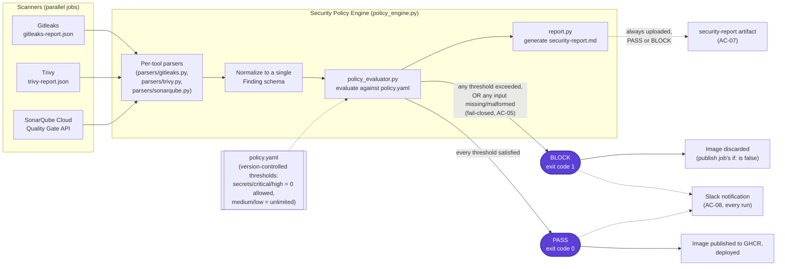

# Security Decision Data Flow

How three differently-formatted scanner reports become one deterministic PASS/BLOCK
decision. This is the core of the project — see
[`docs/architecture/ARCHITECTURE.md`](../architecture/ARCHITECTURE.md) for the
component-level explanation, and `security-policy/policy_engine.py` for the code.

## Why this is fail-closed, not just fail-safe

`policy_evaluator.py`'s outer logic treats **any exception** — a missing report file, a
truncated/malformed JSON payload, a SonarQube API timeout or HTTP error, an unparseable
policy file — as an automatic BLOCK, not a crash. This is unit-tested (27 tests,
`security-policy/tests/test_policy_engine.py`) and live-rehearsed on every
`workflow_dispatch` run via the `policy-gate-negative-rehearsal` job, which exercises 4
distinct failure modes through the real CLI and asserts BLOCK in every case:

| Injected failure | What's tested |
|---|---|
| Malformed Trivy JSON | `json.JSONDecodeError` caught → BLOCK, not a crash |
| Missing Gitleaks report | `FileNotFoundError` caught → BLOCK, not a crash |
| Malformed `policy.yaml` | Unparseable policy → BLOCK, not "no policy = no limits" |
| Unreachable SonarQube host | Connection refused/timeout → BLOCK, not silently skipped |

The same job also re-runs identical inputs 3× (both a PASS case and a BLOCK case) and
byte-compares the decision, stdout, and report (AC-06) — the engine has no hidden
non-determinism (timestamps, ordering, randomness) in its actual decision logic.

## Why Juice Shop itself can never show PASS

Juice Shop is deliberately, organically vulnerable (that's its entire purpose as a
training/test application) — a live scan of `juice-shop/` will always find real
CRITICAL/HIGH findings and secrets. So AC-01/AC-04 ("clean build → PASS") can't be
demonstrated by pointing the real gate at Juice Shop's own code without weakening
`policy.yaml`'s thresholds, which this project treats as off-limits. Instead, the
`policy-gate-pass-rehearsal` job runs the **identical** `policy_engine.py` and
`policy.yaml` against controlled clean fixtures
(`security-policy/tests/fixtures/gitleaks-empty.json`, `clean-trivy.json`,
`sonarqube-passed.json`), proving the PASS path is real and reachable through the same
code path that BLOCKs Juice Shop's own scans every time.
