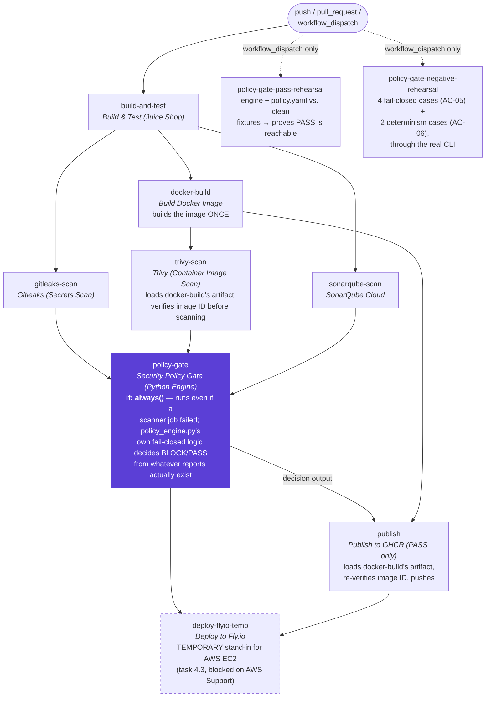
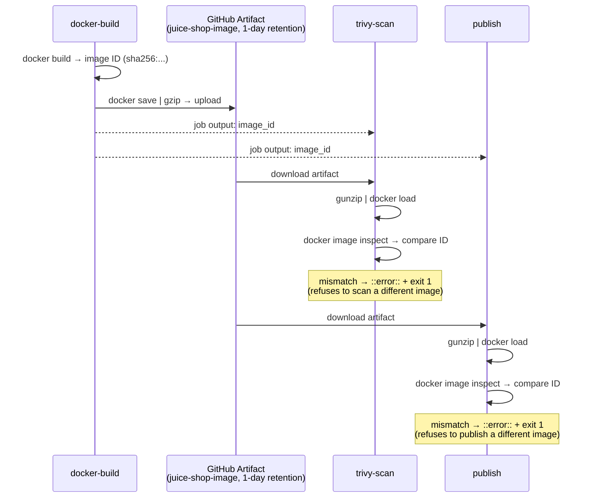

# Pipeline Job Graph

The actual `.github/workflows/ci.yml` job DAG, as of 2026-09-29 (run `36593239493`, the
first fully-green end-to-end run). GitHub renders the Mermaid diagram below natively —
open this file on GitHub, not raw, to see it.



## Why `publish`/`deploy-flyio-temp`'s edges aren't plain arrows

Both jobs' actual `if:` conditions are:

```yaml
if: ${{ !cancelled() && needs.policy-gate.result == 'success' && needs.docker-build.result == 'success' && needs.policy-gate.outputs.decision == 'PASS' }}
```

This is deliberately more than "`needs.policy-gate.outputs.decision == 'PASS'`". GitHub
Actions silently ANDs an invisible `&& success()` onto any job `if:` that doesn't itself
call `always()`/`success()`/`failure()`/`cancelled()` — and that `success()` check spans
the **whole ancestor chain**, not just a job's direct `needs`. `sonarqube-scan` failed
repeatedly for several days (2026-09-24 → 2026-09-29, `new_security_rating` Quality Gate),
and even though `policy-gate` shields *itself* from that with its own `if: always()`, the
invisible check further downstream was silently skipping `publish` regardless of the real
decision. `!cancelled()` plus explicit `.result == 'success'` checks fix that: they
bypass the over-broad transitive check while preserving the real gate (`decision ==
'PASS'`) and the ordinary "my direct dependencies must have succeeded" requirement.
Root-caused with disposable canary jobs on 2026-09-27/28; confirmed fixed live on
2026-09-28 (run `36407858635`). Full write-up: `IMPLEMENTATION_PLAN.md` §20/§23.

## Job-by-job summary

| Job | Trigger | Depends on | Purpose |
|---|---|---|---|
| `build-and-test` | every run | — | npm install, frontend build, `npm test` |
| `docker-build` | every run | `build-and-test` | Builds the Juice Shop image **once**; saves it as a 1-day artifact with its image ID as a job output |
| `gitleaks-scan` | every run | `build-and-test` | Secret scanning; report-only (non-blocking itself — blocking happens in `policy-gate`) |
| `sonarqube-scan` | every run | `build-and-test` | SonarQube Cloud static analysis + Quality Gate wait |
| `trivy-scan` | every run | `docker-build` | Loads and **re-verifies** the exact image `docker-build` built before scanning it |
| `policy-gate` | every run | `gitleaks-scan`, `trivy-scan`, `sonarqube-scan` (`if: always()`) | Runs `policy_engine.py` against `policy.yaml`; the one place PASS/BLOCK is decided |
| `publish` | every run | `policy-gate`, `docker-build` | On PASS only: loads and **re-verifies** the exact image `trivy-scan` scanned, pushes to GHCR |
| `deploy-flyio-temp` | every run | `policy-gate`, `publish` | On PASS only: deploys the exact published image to Fly.io (temporary stand-in for AWS EC2, task 4.3) |
| `policy-gate-pass-rehearsal` | `workflow_dispatch` only | — | Demonstrates AC-01/AC-04's PASS path against clean fixtures (Juice Shop's own code can never PASS a live scan by design — see task 2.5) |
| `policy-gate-negative-rehearsal` | `workflow_dispatch` only | — | Demonstrates AC-05 (fail-closed) and AC-06 (determinism) through the real CLI |

## Image identity, end to end

The image `trivy-scan` scans and `publish` pushes is **provably the same image**
`docker-build` built — not a re-build with potentially different (Juice Shop floats its
dependencies, no lockfile) contents:


